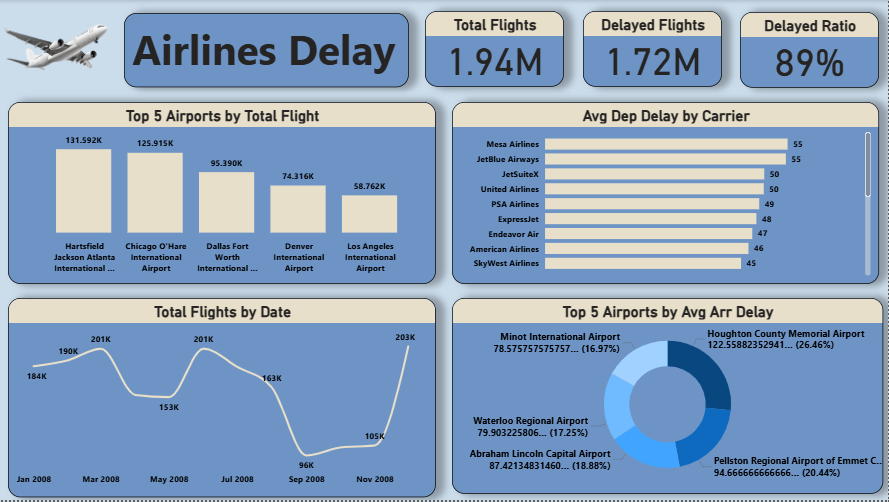

# ✈️ Airlines Delay Dashboard – Power BI Project  

Dashboard project analyzing airline flight delays to identify key performance patterns and top contributing factors.  

This interactive Power BI dashboard visualizes total flights, delay ratios, airport performance, and carrier delay statistics for deeper insights into operational efficiency.  

---

## 📌 Dashboard Overview  

The dashboard includes:  
- Total Flights, Delayed Flights, and Delay Ratio KPIs  
- Top 5 Airports by Total Flights  
- Average Departure Delay by Carrier  
- Total Flights by Date  
- Top 5 Airports by Average Arrival Delay  

---

## 🛠️ Tools Used  
- Power BI  
- Power Query  
- DAX
- Python(Numpy, Pandas)  

---

## 🧠 Skills Demonstrated  
- Data Cleaning and Aggregation  
- DAX Measures for KPIs  
- Designing Multi-visual Layouts  
- Using Bar, Line, and Donut Charts for Comparison  
- Building Dynamic and Responsive Dashboards  

---

## 📂 Dataset 

Data link: https://www.kaggle.com/datasets/giovamata/airlinedelaycauses/data

The dataset contains flight records with details such as:  
- Flight Numbers and Dates  
- Airlines and Carriers  
- Departure and Arrival Delays (minutes)  
- Origin and Destination Airports  
- Total Flight Counts  

---

## 📈 Key Insights  

- Total Flights: **1.94M**, with **1.72M** delayed — giving a delay ratio of **89%**.  
- **Hartsfield Jackson Atlanta** and **Chicago O’Hare** airports recorded the highest total flights (over 120K each).  
- **Mesa Airlines** and **JetBlue Airways** had the longest average departure delays (~55 mins).  
- **Minot International Airport** and **Houghton County Memorial Airport** showed the highest average arrival delays, exceeding **75 mins**.  
- Noticeable dip in total flights around **September 2008**, followed by recovery in late 2008.  

---

## 📊 Dashboard Screenshot  

  
 
---

## 👤 Author  

**Mohammad Anwar Ahmed**  
*Data Analyst – BI Developer*  
